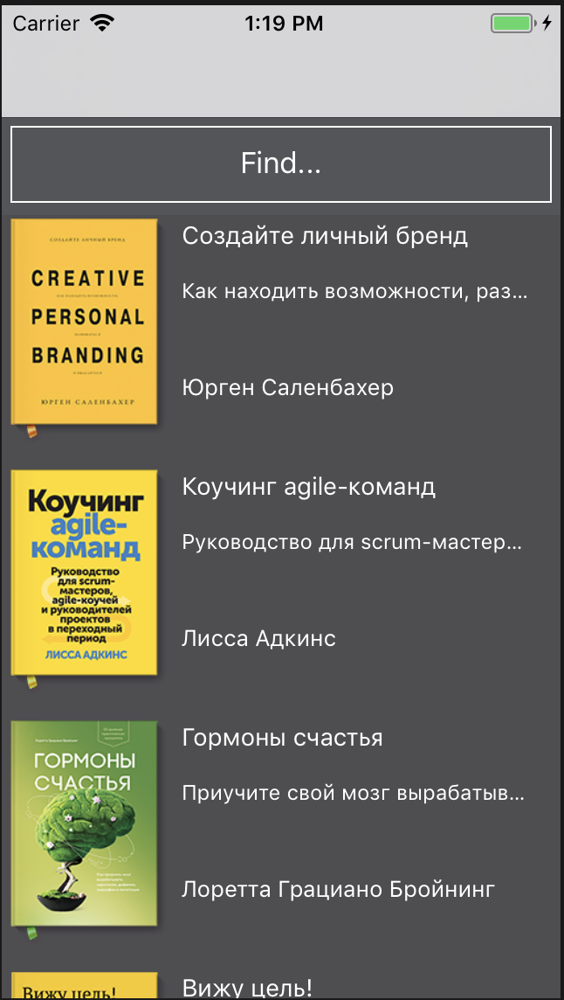

# Book Case App

It's Just Demo App

Platform: iOS. 
Development languages: Swift. 
Development Tools: Xcode. 
Development Technologies: MVVM.  

### ToDo
- [x] SearchBar
- [x] As User I want see Authors in Book list
- [ ] Detail screen `BookDetail`
- [ ] Need to Read list
- [ ] Migrate to Realm
